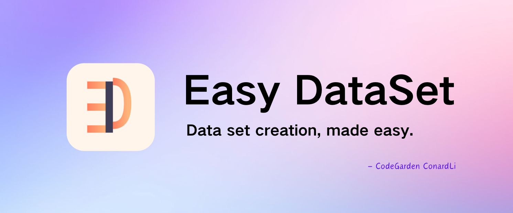

# Product Introduction


&#x20;                                                [**Easy Dataset**](https://github.com/ConardLi/easy-dataset) **是一个强大的大模型数据集创建工具。**


<figure><figcaption></figcaption></figure>

### 为什么会有这个工具？

目前各行各业都在积极探索微调自己行业的大模型，其实微调的过程不是难事，目前市面上也有比较多成熟的工具，比较难的是前期的数据集准备的环节，数据集的质量直接决定了模型微调后的效果，高质量领域数据集的构建始终面临多重挑战，大家在构建数据集的过程中可能会普遍遇到以下问题：


* 完全不知道怎么做，目前就在纯人工去做，想提高效率
* 直接将文档丢给 AI ，但是 AI 对于大文件生成的 QA 对效果比较差
* AI 本身有上下文的限制，一次不能生成太多的问题，分批生成后面又会生成重复的问题
* 已经有整理出来的数据集了，想有一个批量管理数据集的地方，可以进行标注和验证
* 对于数据集有细分领域的需求，不知道如何去构建领域标签
* 想要微调推理模型，但是不知道推理微调数据集中的 COT 怎么构造
* 想从一个格式的数据集转换成另一个格式的数据集，不知道怎么转换


为了解决这些问题，**Easy DataSet 应运而生**，通过系统性解决方案实现从文献解析到数据集构造、标注、导出、评估的全流程闭环，以下是工具预期要解决的问题：


* 能够支持多种文献处理，将各种格式的文献处理为模型可理解的格式
* 能够做到基于 AI 辅助生成数据集，而且不丢失准确性
* 能够解决由于模型上下文限制导致的截断问题
* 能够批量构造数据集，能生成 COT，而且不生成重复的数据集，
* 能够构建领域标签，并且按照领域树组织数据集
* 能够合理的管理数据集，方便对数据集进行质量校验等操作
* 能够方便的对生成的数据集进行格式转换，比如 Alpaca 和 ShareGPT 格式
* 能够基于数据集对模型进行有效评估


### 设计思路

Easy DataSet 以 **项目制** 为核心单元，贯穿 「文献处理-问题生成-答案构建-标签管理-数据导出」 全链路：

<figure><figcaption></figcaption></figure>

### 核心模块

* **模型配置中心**：支持 OpenAI 格式 API（如 OpenAI、DeepSeek、各种三方模型提供商）及本地模型（Ollama），内置模型测试 Playground，支持多模型对比。
* **智能文献处理**：采用  「章节感知递归分块」 算法，基于 Markdown 结构实现语义级分割，确保单块内容完整（最小/最大长度可配），附带大纲提取与摘要生成。
* **领域标签体系**：AI 自动生成二级领域树（如 「体育-足球」 ），支持手动修正，为每个 QA 对绑定精准标签，降低重复率。
* **智能数据生成**：从领域信息中提取问题，基于问题 + 领域信息智能构造数据，并支持多维度数据标注、多格式数据导出。

***

### 数据引擎

* **问题批量生成**：基于文本块语义，按字符密度动态生成问题（可配置），支持批量创建与中断恢复。
* **答案智能构建**：关联原始文本块生成答案，支持推理模型（如DeepSeek-R1）生成带思维链（COT）的答案。
* **质量校验机制**：提供问题/答案的批量删除、手动编辑及AI优化（输入指令自动润色），确保数据可用。

***

### 格式生态

* **多格式导出**：支持 Alpaca、ShareGPT 标准格式，自定义字段映射，包含领域标签与 COT 信息。
* **数据集广场**：聚合 HuggingFace、Kaggle 等多平台数据源，支持关键字一键检索，解决 「数据从哪来」 的初始难题。
